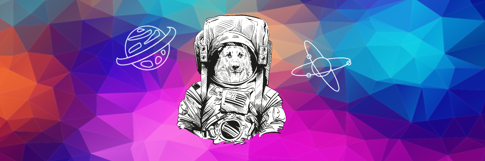

<!-- <h2 align="left">Resume</h2>
 -->



<br>

 
 ```
 
1. NodeJs 기반 백엔드 프레임워크(express, NestJs)에 대해 학습 중입니다.
2. Javascript의 유연함과 Typescript의 생산성에 흥미를 느낍니다.
3. 사용자 경험을 저해하지 않는 튼튼한 Server-side를 구축하고 싶습니다.

```
- Devlog : <a href="https://le2sky.github.io"> le2sky.github.io🚀 </a>
- Contact : le2sky@kakao.com

- Favorite Language💻: 
</a>
</a>

- Backend💻:
</a>
</a>
</a>
</a>


- DevOps💻:
</a>
</a>
</a>

- Unit Test💻:
</a>
 
- Fontend(a little)💻:
</a>
</a>


   
